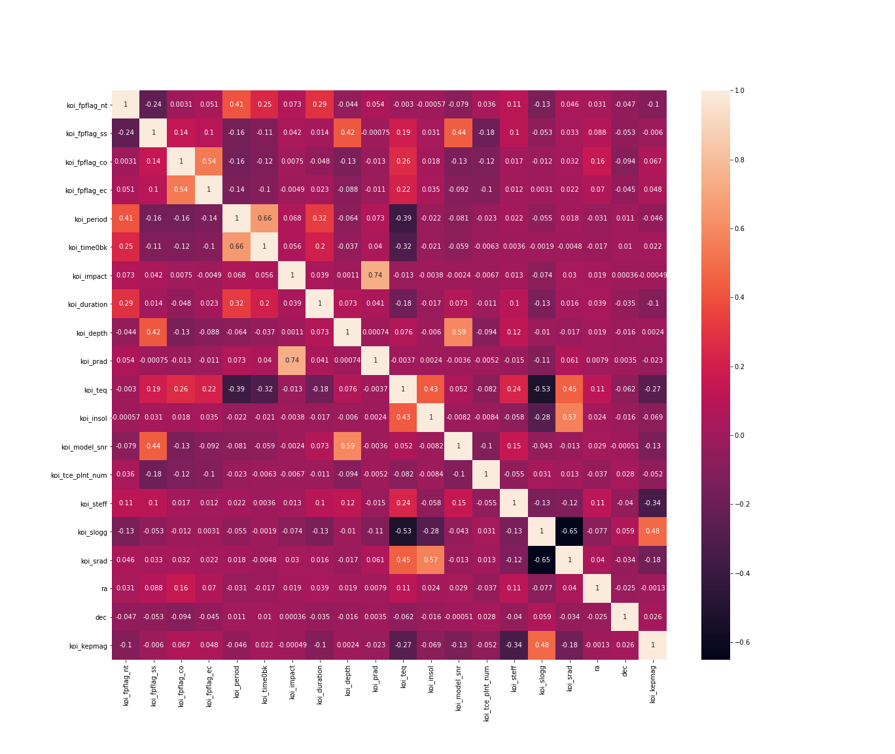
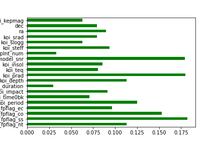

# machine-learning-challenge
The task was to use possible exoplanet data from the Kepler space telescope to develop a machine learning model that is capable of classifying candidate exoplanets.

### Feature Selection
Being new to the subject matter, I started by researching the dataset to determine what some of the columns mean ([this article was particularly helpful](https://exoplanetarchive.ipac.caltech.edu/docs/API_kepcandidate_columns.html)) and also looked into a few articles on feature selection for machine learning. 

I decided to remove the uncertainty columns for each possible feature to simplify the dataset, then started by putting the remaining columns through a correlation matrix to see where there may be relationships.

I also used an information gain calculation method I found in the SciKit Learn documentation (explained on: https://www.analyticsvidhya.com/blog/2020/10/feature-selection-techniques-in-machine-learning/) to see which factors scored highest.

These are in the 'corr.ipynb' notebook.

I also found an article that covered using RandomForest importances to help guide feature selection and decided to run that analysis (in the 'random_forest.ipynb' notebook).

After completing this analysis I had a narrowed down list of features to try with my models.

### Models Run
1. Logistic Regression and then GridSearch to tune: scored 0.8153
2. Deep Learning Neural Network: scored 0.8878
3. K-Nearest Neighbors: scored 0.867

I tried several variations on scaling and features to see how it impacted the final scoring in each model; my notes are in the comments in each notebook. When I initially ran the models with all the features available my results were mostly in the 50-60% range, so my feature selection methods were successful in improving each model's performance.

My models have a reasonable chance at successfully classifying new exoplanets. With further tuning on the input features I feel I could increase the accuracy closer to 90%.